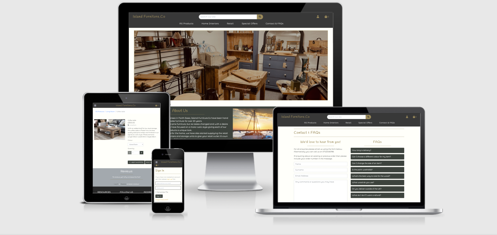
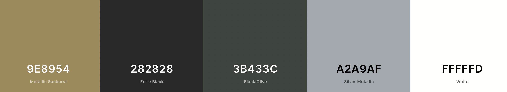

# Milestone Project Four | Island Furniture

 

[View the live project here]()  

## About

This website has been created for my Fullstack Framework Milestone 4 project. 
For this project I have decided to build an e-commerce site based around my dads furniture business. With the hope that in the future it can be used as his own website to advertise and sell his products.

## User Experience-(UX)

### Target Audience

  The target audience for my site is for anyone that wants to add their own unique bit of furniture to their home. 
  As advertised on the site most of the products can be made to measure and availible in many different colours. 
  Although the furniture wont belong in every home, there is no specific audience as it is mainly down to each individuals personal taste. 

### Business Goals

  1. To have a fully functioning e-commerce site where customers can purchase products direct from the site.
  2. Make profit from their products through the site.
  3. Give a platform to advertise their business and showcase what they do.
  4. Build a larger customer base.
  
### User Stories

   * #### As the site owner or Admin I would like:
     1. the site to be attractive, responsive and easy to navigate for the user.
     2. the purpose of the site to be clear to the user.
     3. to add a product easily on the site.
     4. to edit or delete any of the existing products on the site.
     5. Securely store user information and previous orders.
     6. Keep the site secure by only allowing authorised users to access certain areas of the site.
     7. Allow customers to contact the business through the website.

   * #### As a general visitor I would like:
     1. the site to be clear as to what it is selling/providing.
     2. the site to be attractive and easy to navigate between different pages.
     3. the site to be responsive to whichever device I am using.
     4. to easily search for, view and see information on all of the products for sale.
     5. to be able to make a purchase as a guest.
     6. to view and ammend my basket at any time.
     7. to easily and securely enter my payment details.
     8. email confirmation of my order after completion.
     9. to read any reviews left by other customers.
     10. to be able to contact the company directly through the site.

   * #### As a returning user I would like:
     1. to easily register to the site to have my own profile where my details can be stored.
     2. to easily login and out of my account.
     3. to see details of my previous orders.
     4. email confirmation upon registering an account and placing any orders.
     5. to be able to edit my account details and change my password if I forget it.
     6. to leave reviews on any products I have purchased. 

### Design

  When thinking about the design of the site I knew I wanted something fairly neutral and simple in design to help appeal
  to a wider audience, as the site is not targeted towards any specific demographic. With this in mind I chose a colour scheme that I believe contrasts well whilst looking attractive. On some of the pages the layout is broken into different sections with coloured backgrounds to help distinguish between them. For example on the home page the about section is set on a dark green background, with the section directly below placed on a grey background to give a clear separation. As well as on the products detail page there is review section towards the bottom set on a grey background again to help separate the sections and give a bit of conttast to the site. 

  All text on the site is set to a colour that is easily readable against whichever background it sits on, with the hover effect on the links also still readable while giving a clear sign of it being clickable.

* #### Wireframes

  To create my wireframes I used balsamiq. I have done a design for both large and smaller screens to show how the layout of the site will change accordingly with different screen sizes. The links to the wireframes are below.  
  * [Large screens](https://github.com/Ashb87/Ms4-island-furniture/blob/main/assets/wireframes/island-furniture-lg-wireframe.png)
  * [Smaller screens](https://github.com/Ashb87/Ms4-island-furniture/blob/main/assets/wireframes/island-furniture-small-wireframe.png) 

  Most of the design of my site has been kept similar to those in the wireframes. As the design went on and with speaking to my mentor, together we made a few adjustments. Mainly this was positioning of buttons and links. For example on my basket/bag page on the wireframe I have the remove item button below the product image. My mentor advised that this should be a smaller link and off to the side so that the customer isn't drawn to the idea of removing their products.
  I also removed the total cost for each item and decided that just having the total at the bottom of the page was enough.
  For the navbar, in my wireframes I had kept all the product options in one click down button, however when playing with the design I much preferred the look of having the options displayed on the main navbar.
  I also decided to add more information to my footer, after browsing other sites offering similar products I found that most have links to their contact and/or faq pages. So I added these and a business address just to balance the footer out and make it look more professional. 

* #### Imagery

  For the imagery of this site I have used a lot of my dads own stock photos as I wanted to make the site as genuine to his business as I could. However as he is not much of a photographer and clearly doesn't have the best camera, some of the photos aren't as good quality as I would like them to be. Because of this I also wanted to add a few products with better images I got online. I also found that due to the way some of the photos are taken and different styles of furniture, a lot of the photos were different sizes and some were portrait while others were landscape. To get around the issue I decided to set a height for the images on the products page so that when browsing the products, all the images look uniform and helps keep the page looking smarter. Although this does mean thaty for some products part of the image is cut off. Then when a product is clicked and you are taken to the product details page the photo is then shown as intended.  
  If a product is added with no image then a default image will be placed there instead. 
  For the hero image on the home page I have used a photo I took myself from where Island Furniture sells some of their products, using a fade in effect when the page is refreshed. I have also used an image on the about section of a picture taken in West Mersea where the business is based. This is to add to the design of the home page and promote where they are from. 

* #### Colour Scheme

  For the colours on this project I knew I didn't want anything to bold or colourful but also wanted it to be attractive and not boring. While at the same time making sure they contrast together nicely. After playing about with a few colours on my navbar I decided to look at [coolors.co](https://coolors.co/) to get some more ideas. When using the generator I had an idea of a dark green so when one came up that I liked I applied it to my navbar. I then added a gold colour to it for the links. I again changed my mind and decied I wanted the navbar and footer to be a dark grey, but still really liked the green. So I have used it throughout the site on different elements. It can be found as a background colour on my home page. It is the cololur to all my buttons and also used on the faq section. I then changed the bottom links of my navbar to white to contrast nicely with the dark grey and also not have to much of the gold.  
  Throughout the site each page has it's own heading and for this I have used the same gold colour as well as for all my hr rules. The majority of the site is set on a white background as I think it gives a clean look with all the elements contrasting nicely against it. 
  For two other sections, (review section and colours used section) I have used a much lighter grey. I did this to break the site up a little bit and a bit of contrast.  
  Overall I think the colours work well together and give an attractive finish that should appeal to most users. 
  The colours used can be viewed below.

   
   

* #### Typography

  I have used two fonts across the site, both imported from google fonts.  
  They are **Handlee** and **Montserrat Alternates**  
  The Handlee font has been used for my headings and home link text in the navbar. I chose this because I think it's an attractive font with a bit of character to it and so stands out well. The Montserrat Alterantes font has been used for all other text on the site. I chose this because it's a bit different to standard fonts but is still esily readable and works well with the look of the site and both fonts compliment each other well.

## Features

  * ### Across all pages

    * Responsiveness. The site is responsive to all screen sizes for every page no matter what device it is being viewd on.
    * Navbar. The navbar is consistent througout the site and changes depending on the scren size. The home link and bag link remain in the header no matter what size screen. Wheres all the other links are hidden on smaller screens and accessible through the burger icon with a dropdown menu.
    * Footer. The content of the footer remains the same for all screen sizes with links to the contact page, faqs and social media sites. For smaller screens the elements stack on top of each other rather than being side by side with padding and margin added where needed to adapt to the different layout.
    * Messages/Toasts. Messages and Toasts are used when executing certain actions on the site, such as logging in and out, adding and removing products from the shopping bag, completing a transaction, and for admin actions too like adding and editing products.
    * Buttons. The buttons used on the site remain the same througout. I decided to keep all my buttons the same to give a consistent look. All the buttons are clear in their intentions so wont add any confusion to thet user by looking the same. 

  * ### Home Page

    * A hero image with a fade in effect to showcase some of the items for sale.
    * An about us section to give a brief history of the company as well as what they offer today.
    * Asection to promote the colours and paints used on the products that the customers can chose when purchasing an item.

  * ### Products Page

    * A drop down bar allowing the user to chose in what order the products are displayed. For example by price or category.
    * An image for each product to show what is on offer which links to the products detail page.
    * A small bit of information for each product showing its name, price and which category it belongs to.
    * A back to top button to take the user to the top of the page.
    * For admin users there is the added option to edit and delete a product.

  * ### Product details Page 
    
    * A larger image of the product selected.
    * A description of the product including the products dimensions.
    * A drop down box allowing the customer to chose a colour for their product.
    * A quantity selector box to add one or more of the item to their bag.
    * A button to add their selections to their bag.
    * A button to take them back to the products page.
    * Breadcrumb links below the header to navigate back to all products or the current category they are viewing.
    * Reviews for the product if any have been added.
    * The option to add a review if the user is logged in.
    * Add and edit product libks for admin user only.

  * ### Shopping bag page

    * A summary of each item added to the bag with a picture, item name and colour chosen. Price of that item and a selector box giving the user the option to add another of the same product and then update the total.
    * A summary giving the total bag cost, delivery cost and then the total cost of the two combined.
    * A button to take the user back to the products to carry on shopping.
    * A button to take the user to the checkout page.

  * ### Checkout page

    * An order summary showing the user everything they have in their bag and the total cost of their purchase.
    * Delivery form that allows the user to input their delivery information
    * An option for users with a profile to save their information to their profile.
    * Stripe input element where users can input ttheir card details to pay for the products.
    * A button link to take them back to the bag page incase they want to adjust anything.
    * A complete purchase securely button that allows the user to process their order and complete their purchase.
    * Text warning alerting the user that payment WILL be taken upon completing their order
    * A confirmation email will be sent to the user with information about their recent purchase.

  * ### Checkout success / Order history page

    * A total summary of the users order including price, order number, order date and delivery information.
    * Button at the bottom of the screen showing an option to either navigate back to products page or back to the users profile depending on whether the user completed a new order, or viewed a previous order from the profile screen.

  * ### Sign in / Sign up page

    * On the sign up page the user can register an account by providing an email address, username and password. All required so will show an error if the information is eneterd incorrectly.
    * On the login page the user can login to their account by entering their username or email address as well as their password.
    * on the login page the user has link to click if they have forgotten their password where they are then directed to a different page and asked to enter their email address. They will then recieve an email giving them steps to reset their password.
    * On the login page they also have the option to click the remember me button so they wont have to enter their details everytime.

  * ### Profile page

    * Shows the user all their default delivery details and allows them to update it.
    * Shows all previous orders from their account with a link to click on previous order numbers which takes them to the history page for that specific order.
    * A button link allowing the user to change their password.

  * ### Add / Edit products page - Admin only -

    * Add product allows the admin to add a new product to the site. They can enter the category, name, description, price, whehter it can be painted and the otion to add an image.
    * Buttons to either cancel or complete the action.
    * On the edit page the item they are editing is autofilled with all its existing information. The admin then has the option to edit any of the fields they require.
    * Buttons to either cancel or confirm updating the product.

  * ### Contact & FAQ page

    * The page is split down the middle for larger screes with a contact form on the left and the FAQs down the right.
    * The contact form allows a user to add their name, email address and a message to send to the email address linked to the site. When a message is sent they will recieve a confirmation email to say there message has been recieved.
    * FAQs displayed in an accordion, so a user can click on any question and the information relating to that question will dropdown below it. 

## Future Features I would like to implement

  * ### Adding reviews
  
    * Although the site already has a reviews section that is only availible to users with a profile, I would like to take this further and add a function that only allows a user to leave a review for an item they have already purchased.
  
  * ### Size options

    * I would like each product to have different sizes availible and for the price to change accordingly.

  * ### Average rating

    * I would like for the rating left by the users to review to return an average rating for that specific item.

  * ### Pagination

    * Pagination on products would allow for only a set number of products to show per page. Although my site doesn't have a large number of products, for e-commerce sites with lots of products, it would not be viable to a user to have to take the time to continuously scroll down without knowing when the product list will end.

  * ### Social media logins

    * Logging in through social media sites is an increasingly popular feature on many sites, implementing this would be good for users to make the logging in process quicker and smoother.

## Technologies Used

### Languages

  * [HTML5](https://developer.mozilla.org/en-US/docs/Web/Guide/HTML/HTML5)  
  * [CSS3](https://developer.mozilla.org/en-US/docs/Web/CSS)  
  * [JavaScript](https://developer.mozilla.org/en-US/docs/Web/JavaScript)  
  * [Python](https://www.python.org/)

### Frameworks, Libraries and Programs Used

  * [Django](https://www.djangoproject.com/)  
     Django was used as the main framework to build the site
  * [Bootstrap](https://getbootstrap.com/) 
     Bootstrap was used to help build the structure of the website and add responsiveness across different screen sizes.
     It also supplied a lot of the styling like paddings and margin as well as built in components such as the modal.
  * [Balsamiq](https://balsamiq.com/)  
     I used balsamiq to design and draw up my wireframes before starting the project.
  * [Google Fonts](https://fonts.google.com/)  
     Google fonts was used throughout the project to import my selected fonts.
  * [Font Awesome](https://fontawesome.com/)  
     Font awesome was used to add all icons used on the site.
  * [Gitpod](https://www.gitpod.io/)  
     Gitpod was the text editor I used for this project.
  * [Git](https://git-scm.com/)  
     Git is used as version control software to add, commit and push code to my GitHub repository where the code is then stored.
  * [GitHub](https://github.com/)  
     I have used GitHub as a remote repository to push and store the committed changes to my project from Git.
  * [Google Chrome Developer Tools](https://developer.chrome.com/docs/devtools/)  
     I have used Google chromes built in developer tools to help with the styling of the site, selecting colors and to help fix any bugs I found.
  * [Heroku](https://id.heroku.com)  
     Heroku has been used to deploy my live site.
  * [SQlite3](https://www.sqlite.org/index.html)  
     Used as the development database
  * [PostgreSQ](https://www.postgresql.org/)  
     Used as the database for the deployed site.
  * [Stripe](https://stripe.com/gb)  
     Used to handle card payments through the site.
  * [AWS S3](https://aws.amazon.com/)  
     Amazon Web Services, used for hosting images and static files

## Testing 

Find the full Testing Document [here!](TESTING.md)

### User stories and site goals

    