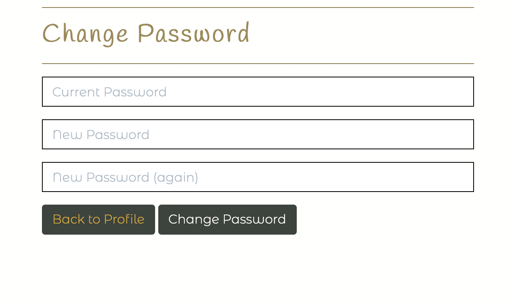

# Milestone Project Four | Island Furniture

## Testing Document

### User stories

#### Site owner and Admin

  **1. the site to be attractive, responsive and easy to navigate for the user.**

  - To get feedback on the visual aspect of the site I have shared it with friends and family as well as members of the code institute slack community and asked them for their honest feedback. The feedback I recieved regarding the overall look of the site was very positive. The colour palette was very popular and the layout of the site in general recieved some really good feedback
  - Again I asked them for feedback on how easy it was to navigate around the site. With the clear links in the navbar and more buttons placed throughout the site to help navigate quicker, the feedback recieved was very positive. 
  - To make the site responsive I used the bootstrap grid system. This helps to easily achieve different break points for different screen sizes. To help test this as I was developing the site I was using chrome dev tools continuously so I could keep a check on how the site was responding on differnet screens. On top of this I also have access to a few screen sizes to test it on myself. These were an Iphone xr, Iphone 12, Samsung galaxy tablet, Ipad mini, and Macbook air. Each giving me a good example of how it can look on different screens with each screen displaying as I intended.

  **2. the purpose of the site to be clear to the user.**

  - When first entering the site the user is presented with a large hero image displaying differnet bits of furniture. 
  There is also an *about me* seciton on the home page giving a brief description of what the company is about. The *Island Furniture* logo link remains at the top of the screen the whole time and when clicking on any product link the user can see exactly what is for sale. 

   
  
    

  **3. to add a product easily on the site.**

  - When an admin user is loogged in they can click on the *Product Management* link in the profile dropdown menu.
  From here they are presents with a form to fill in giving all the product details and the option to add an image.
  This has been tested many times and most of the products on the site have been added this way. I decided to only add a few products in development so that when I had installed the postgres database I could add a lot more whilst checking the functionality of it all at the same time. It works every time as expected with the product saving to the database and displaying in the correct category on the site.

  
   

  **4. to edit or delete any of the existing products on the site.**

  - When the admin user is logged in they can go to the products page and click on the edit button to edit that specific item. This links to the edit product page where they are given the form used for adding a product but with the product details already filled in. They can then edit it as they like and click the confirm edit button and the product is updated and a success message is displayed to let the admin know it has worked. I have tested this many times on different products and the fields are changed and updated as expected and saved to the database. 

  
   
   

  - To delete a product the admin can click the delete product button. This will bring up a modal asking if they are sure they want to deete that specific product and if they confirm will show a success message. This has been tested many times by adding products and then deleting them again.

  
   
   

  **5. Securely store user information and previous orders.**

  - When a user has registered a profile on the site or placed an order, the information is stored in the postgres database which can be accessed and viewed through the django admin. To test this I have made different user accounts and ordered products through the site to check all details are being stored correctly.

  
   
   

  **6. eep the site secure by only allowing authorised users to access certain areas of the site.**

  - To keep a non admin user from accessing the product management pages I have assigned those links to superusers only. If a user trys to add *admin* to the end of the url they will be predented with the django login page. There are also other error pages in place to stop users from accessing parts of the site they are not permitted to use.

  **7. Allow customers to contact the business through the website.**

  - In the navbar and footer there are links to a contact page for a user to send a direct email to the site. They are presented with a contact form asking for their name, email address and messsage. When the email has been sent a success message will appear on the screen and they will be sent a confirmation email to say their message has been received. 
  I have tested this many times to make sure it all works as expected.  

  
   
   

#### General visitors

  **1. the site to be clear as to what it is selling/providing.**

  - See point 2 from site owner and admin section.

  **2. the site to be attractive and easy to navigate between different pages.**

  - See point 1 from site owner and admin section.

  **3. the site to be responsive to whichever device I am using.**

  - This has been tested extensively by friends, family and members of the code institute slack community to get as varied selection of screen sizes and devies that I can, as well as testing it myself on various screen sizes. I was also using chrome dev tools continuously through development to check the various breakpoints and add media queries where necessary. It has also been put through the [am i responsive](http://ami.responsivedesign.is/) mockup screenshot generator and the resulting image has been used at the top of the README file.

  **4. to easily search for, view and see information on all of the products for sale.**

  - The user can click on the links in the navbar to either view all products or choose a specific category. When on the products page they can also chose how they would like to view the products by selecting price, a-z or by category. This search filter has been tested many times without any issues. 
  - When a user clicks on a product they are then linked to the product details page for that specific product where they will see more information about it. All links work as expected.
  - They can also use the search bar at the top of the screen on larger devices or in the dropdown menu on smaller ones. Here they can type a word and if it is found in a name or description of a product theb these will be returned for the user to view. This all works as expected with no issues. 

  
   
   
  
  
   

  **5. to be able to make a purchase as a guest.**

  - To make a purchase a guest it works exactly the same as a user with a profile. They will still get a confirmation email and the details will be stored in the database for the admin to view. When entering their payment details they are shown a link to create a profile telling them they will be bale to save their information if they do so. 
  - I have made test purchases as a guest and everything works as expected.

  **6. to view and ammend my bag at any time.**

  - When a user has added items to their bag they will be displayed with a success message that will have a link to their bag. The bag link in the navbar will also be updated and change the amount of items they have in their bag. At first I had this show the total value of their bag but after viewing other e-commerce stores it seems quite common to just show how many items they have rather than the cost. I decided I preferred this approach so implemented it to my project. 
  They can also click the bag link in the navbar and this will also take them to their bag page. 
  - When viewing their bag they will have the option to delete or update the quantity of items. When clicking delete the item will be removed from their bag. Or they can ammend the amount of each item in the bag and click update. This then updates the total value of the bag. This has been tested many times without any issues. 

  
   
   
  
  
   

  **7. to easily and securely enter my payment details**

  - When making a purchase the user is asked to enter their card details. They will need to enter the long card number, the expiry date and the CVV number. This payment is then authorised through stripe which is a PCI compliant service provider offering high levels of security for all processed payments. 

  **8. email confirmation of my order after completion.**

  - After completing a payment the user will be displayed a success message telling them they will receive a confirmation email for their order. This is then sent to their given email address with details of their purchase. I have tested this with many test purchases and the emails are sent as expaected with no errors. 

  
   

  **9. to read any reviews left by other customers.**

  - When a user clicks on a product and links to the product page, at the bottom of this page there is a review section. If a review has been left then any user is able to read these reviews. I have displayed these using an accordion so the user will see the review name and stars given. They can then click on the review and this will then drop down the rest of the review. As reviews are added they stacked below each other. I have added reviews to check this all works and displays as intended with no issues. 

  
   

  **10. to be able to contact the company directly through the site.**

  - See point 7 from site owner and admin section.

#### Returning Users

  **1. to easily register to the site to have my own profile where my details can be stored.**

  - Through the links in the navber a user can choose to register an account by filling in their details on the form provided. These details are then stored in the database. They will then be sent an email to confirm their registration. I have created various test accounts, deleted them through the django admin and recreated them. I have tested adding a new user with an existing email address or username and as intended an error is shown to the user to say that it already exists.

  
   

  **2. to easily login and out of my account.**

  - Depending whether a user is logged in or out they can easily do either one by clicking the profile link and following the required steps. A success message is displayed to tell the user if they have signed in or logged out. This all works as expected with no errors. 

  
  
   

  **3. to see details of my previous orders.**

  - When a user is logged in they can click on thier proofile. Here they will see a list of their previous orders. 
  In the list they can click on the order number and this will link them to the full details of that specific order. This has been tested with different test orders and works with out problems. 

  
  
   

  **4. email confirmation upon registering an account and placing any orders.**

  - When a user registers for an account they will be sent a confirmation email with a link to confirm their email address. This has been tested for every account I have created and works without errors. 

  **5. to be able to edit my account details and change my password if I forget it.**

  - A user can click on their profile page and will be shown all their saved information. Here they can edit and update it as they please. The form is prefilled with their existing details. There is also a button at the bottom to allow them to change their password. It will link them to a page where they can enter their existing password and then enter a new one. I have tested this with different users and all works as expected with the new details being saved to the database..

  
  
   

  **6. to leave reviews on any products I have purchased.**

  If a user is logged in they can go to any product detail page and leave a review using the reviews form. Each added review is then displayed on that products page. This all works without any errors.

  
   

