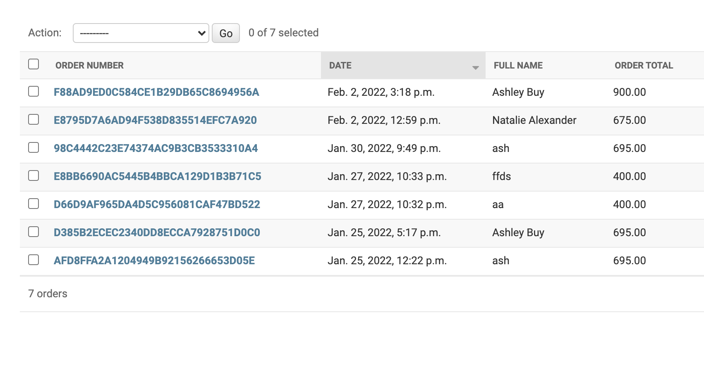

# Milestone Project Four | Island Furniture

## Testing Document

* [Testing](#testing)
    - [User Stories](#user-stories)
    - [Features Testing](#features)
    - [Responsive Testing](#responsive-testing)
    - [Lighthouse Testing](#lighthouse-testing)
    - [Code Validators](#code-validators)
    - [Further Testung](#further-testing)
    - [Known Issues and Bugs](#known-issues-and-bugs)

<hr>

## User stories

### Site owner and Admin

  **1. the site to be attractive, responsive and easy to navigate for the user.**

  - To get feedback on the visual aspect of the site I have shared it with friends and family as well as members of the code institute slack community and asked them for their honest feedback. The feedback I recieved regarding the overall look of the site was very positive. The colour palette was very popular and the layout of the site in general recieved some really good feedback
  - Again I asked them for feedback on how easy it was to navigate around the site. With the clear links in the navbar and more buttons placed throughout the site to help navigate quicker, the feedback recieved was very positive. 
  - To make the site responsive I used the bootstrap grid system. This helps to easily achieve different break points for different screen sizes. To help test this as I was developing the site I was using chrome dev tools continuously so I could keep a check on how the site was responding on differnet screens. On top of this I also have access to a few screen sizes to test it on myself. These were an Iphone xr, Iphone 12, Samsung galaxy tablet, Ipad mini, and Macbook air. Each giving me a good example of how it can look on different screens with each screen displaying as I intended.

  **2. the purpose of the site to be clear to the user.**

  - When first entering the site the user is presented with a large hero image displaying differnet bits of furniture. 
  There is also an *about me* seciton on the home page giving a brief description of what the company is about. The *Island Furniture* logo link remains at the top of the screen the whole time and when clicking on any product link the user can see exactly what is for sale. 

   
  
  <br> 

  **3. to add a product easily on the site.**

  - When an admin user is loogged in they can click on the *Product Management* link in the profile dropdown menu.
  From here they are presents with a form to fill in giving all the product details and the option to add an image.
  This has been tested many times and most of the products on the site have been added this way. I decided to only add a few products in development so that when I had installed the postgres database I could add a lot more whilst checking the functionality of it all at the same time. It works every time as expected with the product saving to the database and displaying in the correct category on the site.


  
  <br>

  **4. to edit or delete any of the existing products on the site.**

  - When the admin user is logged in they can go to the products page and click on the edit button to edit that specific item. This links to the edit product page where they are given the form used for adding a product but with the product details already filled in. They can then edit it as they like and click the confirm edit button and the product is updated and a success message is displayed to let the admin know it has worked. I have tested this many times on different products and the fields are changed and updated as expected and saved to the database. 

  
   
  <br>

  - To delete a product the admin can click the delete product button. This will bring up a modal asking if they are sure they want to deete that specific product and if they confirm will show a success message. This has been tested many times by adding products and then deleting them again.

  
   
  <br>

  **5. Securely store user information and previous orders.**

  - When a user has registered a profile on the site or placed an order, the information is stored in the postgres database which can be accessed and viewed through the django admin. To test this I have made different user accounts and ordered products through the site to check all details are being stored correctly.

  
   
  <br>

  **6. eep the site secure by only allowing authorised users to access certain areas of the site.**

  - To keep a non admin user from accessing the product management pages I have assigned those links to superusers only. If a user trys to add *admin* to the end of the url they will be predented with the django login page. There are also other error pages in place to stop users from accessing parts of the site they are not permitted to use.

  **7. Allow customers to contact the business through the website.**

  - In the navbar and footer there are links to a contact page for a user to send a direct email to the site. They are presented with a contact form asking for their name, email address and messsage. When the email has been sent a success message will appear on the screen and they will be sent a confirmation email to say their message has been received. 
  I have tested this many times to make sure it all works as expected.  

  
   
  <br>

### General visitors

  **1. the site to be clear as to what it is selling/providing.**

  - See point 2 from site owner and admin section.

  **2. the site to be attractive and easy to navigate between different pages.**

  - See point 1 from site owner and admin section.

  **3. the site to be responsive to whichever device I am using.**

  - This has been tested extensively by friends, family and members of the code institute slack community to get as varied selection of screen sizes and devies that I can, as well as testing it myself on various screen sizes. I was also using chrome dev tools continuously through development to check the various breakpoints and add media queries where necessary. It has also been put through the [am i responsive](http://ami.responsivedesign.is/) mockup screenshot generator and the resulting image has been used at the top of the README file.

  **4. to easily search for, view and see information on all of the products for sale.**

  - The user can click on the links in the navbar to either view all products or choose a specific category. When on the products page they can also chose how they would like to view the products by selecting price, a-z or by category. This search filter has been tested many times without any issues. 
  - When a user clicks on a product they are then linked to the product details page for that specific product where they will see more information about it. All links work as expected.
  - They can also use the search bar at the top of the screen on larger devices or in the dropdown menu on smaller ones. Here they can type a word and if it is found in a name or description of a product theb these will be returned for the user to view. This all works as expected with no issues. 

  
   
  <br>
  
  
  <br>

  **5. to be able to make a purchase as a guest.**

  - To make a purchase a guest it works exactly the same as a user with a profile. They will still get a confirmation email and the details will be stored in the database for the admin to view. When entering their payment details they are shown a link to create a profile telling them they will be bale to save their information if they do so. 
  - I have made test purchases as a guest and everything works as expected.

  **6. to view and ammend my bag at any time.**

  - When a user has added items to their bag they will be displayed with a success message that will have a link to their bag. The bag link in the navbar will also be updated and change the amount of items they have in their bag. At first I had this show the total value of their bag but after viewing other e-commerce stores it seems quite common to just show how many items they have rather than the cost. I decided I preferred this approach so implemented it to my project. 
  They can also click the bag link in the navbar and this will also take them to their bag page. 
  - When viewing their bag they will have the option to delete or update the quantity of items. When clicking delete the item will be removed from their bag. Or they can ammend the amount of each item in the bag and click update. This then updates the total value of the bag. This has been tested many times without any issues. 

  
   
  <br>
  
  
  <br>

  **7. to easily and securely enter my payment details**

  - When making a purchase the user is asked to enter their card details. They will need to enter the long card number, the expiry date and the CVV number. This payment is then authorised through stripe which is a PCI compliant service provider offering high levels of security for all processed payments. 

  **8. email confirmation of my order after completion.**

  - After completing a payment the user will be displayed a success message telling them they will receive a confirmation email for their order. This is then sent to their given email address with details of their purchase. I have tested this with many test purchases and the emails are sent as expaected with no errors. 

  
  <br>

  **9. to read any reviews left by other customers.**

  - When a user clicks on a product and links to the product page, at the bottom of this page there is a review section. If a review has been left then any user is able to read these reviews. I have displayed these using an accordion so the user will see the review name and stars given. They can then click on the review and this will then drop down the rest of the review. As reviews are added they stacked below each other. I have added reviews to check this all works and displays as intended with no issues. 

  
  <br>

  **10. to be able to contact the company directly through the site.**

  - See point 7 from site owner and admin section.

### Returning Users

  **1. to easily register to the site to have my own profile where my details can be stored.**

  - Through the links in the navber a user can choose to register an account by filling in their details on the form provided. These details are then stored in the database. They will then be sent an email to confirm their registration. I have created various test accounts, deleted them through the django admin and recreated them. I have tested adding a new user with an existing email address or username and as intended an error is shown to the user to say that it already exists.

  
  <br>

  **2. to easily login and out of my account.**

  - Depending whether a user is logged in or out they can easily do either one by clicking the profile link and following the required steps. A success message is displayed to tell the user if they have signed in or logged out. This all works as expected with no errors. 

  
  
  <br>

  **3. to see details of my previous orders.**

  - When a user is logged in they can click on thier proofile. Here they will see a list of their previous orders. 
  In the list they can click on the order number and this will link them to the full details of that specific order. This has been tested with different test orders and works with out problems. 

  
  
  <br>

  **4. email confirmation upon registering an account and placing any orders.**

  - When a user registers for an account they will be sent a confirmation email with a link to confirm their email address. This has been tested for every account I have created and works without errors. 

  **5. to be able to edit my account details and change my password if I forget it.**

  - A user can click on their profile page and will be shown all their saved information. Here they can edit and update it as they please. The form is prefilled with their existing details. There is also a button at the bottom to allow them to change their password. It will link them to a page where they can enter their existing password and then enter a new one. I have tested this with different users and all works as expected with the new details being saved to the database..

  
  
  <br>

  **6. to leave reviews on any products I have purchased.**

  If a user is logged in they can go to any product detail page and leave a review using the reviews form. Each added review is then displayed on that products page. This all works without any errors.

  
  <br>

## Features

### All pages

  **- Responsiveness**

  - As mentioned in the user stories testing section, the responsiveness of the site has been tested extensively on many screen sizes on lots of different devices. The site responds as I inrtended at the differnet breakpoints. 

  **- Navbar**

  - The navbar display adapts depending on the screen size. For larger screens all the main links can be seen in the nav bar, consisting of the home link, search bar, profile and bag link on one line. Then below is the links to all the products and the contact & FAQ form. On smaller screens this is broken down so just the home link, and bag link are visible with all the other links being side the drop down menu accessed by the burger icon. All the links in the navbar work as expected after testing each one many times.  

  
  
  <br>

  **- Footer**

  - The footer consists of 4 differnt links. Two to social media and the other two link to the contact and FAQ page. These links work as expected with social links opening in a new page. The footer collapses on smaller screens as intended with no issues. 

  
  <br>

  **- Messages/Toasts**

  - All messages and toasts are displaying correctly with the correct alert depending on the message, i.e success, warning, info and error. Some screenshots of the toasts can be seen in the user stories testing section.

  **- Buttons** 

  - All buttons are working correctly and linking to the correct urls. 

### Home page

  - The hero image effect takes effect when the page is refreshed or the user links back to the home page.

  
  <br>

### Products page

 - The drop down bar allows the user to choose in what order they would like to view the sites products. This works as expected and changes the order of products depending on the users selection.
 - The product image on the products page will link the user the detail page of that specific product. This has been tested many times and works without errors. 
 - When viewing on smaller screens and the products are stacked on top of each other the back to the top button is a quick way for the user to get back to the top of the screen without scrolling back up. This is working as intended. 
 - Edit and delete buttons added to the products for admin users only. this has been tested extensively and works with no issues. 

### Products detail page

- On the products detail page the image appears larger than on the all products screen. This can then be clicked again to view an even larger version of the image, opened on a separate page. 
- There is a drop down box that allows the user to pick a colour for their product. When selected this is added on to their order details. I have tested this many times and works with no issues. 
- The quantity selector box allows the user to choose how many of that item they would like to buy. This updates as expected and updates the total value of the bag. It has been tested and works as expected. 
- Button to add item to bag works as intended and updates the bag contents. 
- Button back to products page works as it should. 
- The breadcrumb links display the current product, a link to the category it belongs to and a link back to all products. All links have been tested and work with no errors.


<br>

- Reviews added for products all work and are displayed as intended. 
- If the user is logged in to their profile then they will be displayed with the review form to fill in and submit. This has been checked for users not logged in to make sure it doesn't still display. I have also added reviews to the site to check it all works as intended.
- The add and edit product buttons are only visible to an admin user. This has ben tested by checking with regular users. Buttons link to correct urls and work as intended with no issues. 

### Shopping bag page

- All correct information for each added product is displayed. With the option to add more or remove items tested and working. 
- The value of the bag is added correctly taking in to account a delivery charge if there is one. I have tested this by editing the bag to check it all updates correctly and uses the free delivery threshold accordingly. 
- Button link to continue shopping takes user back to the all products page. Works correctly. 
- Button link to the checkout page works and directs user to secure checkout page. 

### Checkout page

- Order summary shows the correct total value of the bag. I have tested this many times with different products to make sure it is all workng correctly. 
- The delivery information form is rendered using crispy forms and displays as intended and checks on the required fields to make sure they are filled in correctly. 
- The stripe payment element all works with no errors. This has been tested many times with the test card number to check the payment process all goes through as intended. 
- A button to take the user back to their bag page befoer finishing the checkout process is working corectly. 
- The complete order button finishes the checkout procedure and processes the payment with out any issues. I have tested this many times to make sure it is all working correctly. 
- Confirmation emails are sent to the users given email address detailing the order they have just placed. This is working with no issues. 

### Checkout success / Order history page

- After completing an order the user is taken to the checkout success page where they will have a full description of all the order details. This has been tested many times and always returns the correct information and works as it should. 
- Buttons at the bottom of the screen depending on how the user got to that page (either from ordering a product or their profile page) will navigate back to differnt urls. These buttons display correctly on the right page and link the user to the correct url. 

### Sign in / Sign up page

- I have tested the sign up page with lots of different users to check it all works correctly. Everyting works as expected and the user profile is added to the database. 
- Logging in works with no issues. This has been tested many times for all the differnet accounts with no issues. 
- Users trying to log in can click a link if they have forgotten their password. This link directs them to a new page where they will need ot enter their email address. I have tested changing passwords for different users and all works correctly. 
- Clicking the remember me button works. I have tested this for a couple of the users and tried logging in again. This works as I would expect it to. 

### Profile page

- Users can view all their delivery information on their profile page and update it as they would like to. This has been tested for different users. Everything updates and saves to the database with no issues.
- A list of all previous orders is also displayed on the users profile page. The oorder number link works and direct the user to the order history of each specific order number. This all works as intended. 
- The button at the bottom of the page allows the user to change their password. It will direct them to a new page where they can change their password. This has been tested for different users and all works correctly. 

### Add / Edit products page - Admin only -

- Adding a product to the site is only available for admin users. I have tested this many times and added most of the products to the site this way. This was a great way to check it was all working correctly. I had no issues or errors with adding products this way. 
- The cancel or complete buttons work as intended woth no issues. 
- When editing a product the form is prefilled with the existing product information. This can be changed by ammending any of the fields and confirming the changes. This has also been tested many times and works without any issues or errors. 
- The buttons to either cancel or confirm the changes work as intended. 

### Contact & FAQ page

- The contact form has been tested to check it all works as intened and sends confirmation emails to the user. The message is then added to the database and can be viewd in the django admin page. This is all tested and working correctly. 
- The FAQs are displayed how I intended with the accordion dropdown function working corretly. 

## Responsive Testing

- To help with the responsiveness of my project I was using chrome dev tools throughout the build of the site. This helped to see how it would adapt to different screen sizes and devices. It helped me choose appropriate font sizes and headings so to not look too large on the smaller screens and also enabled me to determine at which point I would need to add any media querys for different breakpoints. Thanks to the use of the bootstrap grid system I didn't need to use too many media querys as the site naturally responded well to different screen sizes.
- As well as using the chrome dev tools I also tested the site myself across as many different devices that I had access to. Theese included **Iphone xr,** **Iphone 12,** **Ipad mini,**
**Samsung galaxy tablet,** **Apple macbook air** and a 21.5 inch **Apple imac** These devices gave me a good variation of the most common screen sizes used. The site responded well to each of the different screen sizes and displayed as I intended. On top of this I asked friends and family to test the site on their own devies to get even more feedback with devices I don't have access to. 
- When I felt the site was close to being complete I used the mockup screenshot generator **am I responsive** to get an image of how how the site responds on different size screens across different devices and have used this image at the top of this README file.

## Lighthouse Testing

To check the performance of the site I ran all the main pages through the lighthouse google chrome dev tool.<br>
The results can be seen below. 

### Home Page

<br>

### Product Page

<br>

### Product Detail Page

<br>

### Profile Page

<br>

### Contact Page

<br>

- Overall I was happy with the results with SEO scoring 100 on every page and Performance overall scoring well other than on my home page. One of the warnings was due to image files being too large. I resized the images and made the files smaller but this didnt seem to change the score when I retested it. 
- The best practice score had consistent warnings across the pages which read "Includes front end javaScript libraries with known security vulnerabilities" This was highlighted as being an issue with jQuery which is being imported from bootstrap. 
- On the product and product details page the Accessibility scores are lower than on the other pages. There was a warning that read "background and foreground colors do not have a sufficient contrast ratio" Highlighting the **edit** button that is availible to the admin to edit a product. Although it was highlighted as an issue I believe there is sufficient cotrast ratio and don't think it causes an issue. It also had a warning that read "heading elements are not in a sequentially descending order" This was further highlighted by having h4 elements in the footer and I believe because I have an h4 element in my modal. I believe I have picked the suitable sized headings for their placement with in the site so didnt feel the need to try and change this. 

## Code Validators

### HTML validation

- To test my HTML code I used the [W3C Markup Validator Tool](https://validator.w3.org/)
- There were no errors found 


<br>

### CSS validation

- To test my CSS code I used the [W3C CSS Validator Tool](https://jigsaw.w3.org/css-validator/)
- There were no issues found


<br>

### Javascript validation

- To test my javaScript code I used the [JSHint tool](https://jshint.com/)
- No errors were found

### Pep8 validation

- To test my python code I used the [pep8 validator](http://pep8online.com/) <br>
- All tests passed

Please Note - Warnings and errors were given on most pages due to template logic being used in this project. I reduced the amount of warnings by as many as I could.

## Further Testing

- I have extensively tested every element of my site to check all functions are working as they are intended. I have used many differnet devices and screen sizes to check for responsiveness. 
- I have tested the site on three of the most popular internet browsers: *Google chrome* *Safari* and *Microsoft edge* with each of the browsers displaying the same and all working correctly. 
- I have asked friends, family and members of code institutes slack community to test the site for me and have had no issues or errors reported back to me. 

## Known Issues and Bugs

- When scrolling down a page the back to top button works as intended and will take the user back to the top. However I have noticed that if you scroll right to the bottom so that the button is sitting in the footer it seems to become inactive. This is an issues I have noticed late on in the development and am yet to find a solution to the problem. 
- During development I was testing the function of adding a product. This was all working fine. I then added one of the new items to my bag. Before removing the item from my bag I deleted the product from the database. This then caused an error across all pages of my site. After a lot of retracing my actions and trying to figure what I had done wrong, I decided to use tutor support. They suggested I deleted my session cookies and this then resolved the issue. 
- The images I have on my home page to promote what paint colours are on offer were displaying correctly when viewing the site form gitpod. But when viewing through the deployed site through heroku they were not being displayed. I thought maybe there was an issue with the link to my aws bucket but other images were showing up so quickly ruled that out. It turned out I was using the wrong syntax for the link and needed to use {{ MEDIA_URL }} rather than the media/img-name that I had been using. 
- when creating my error pages and then testing them I was getting an internal server error instead of being directed to the correct error template. I was having trouble trying to see where the problem was coming from and so tried setting the debug back to true and see if django would show me an error message that could help. I had no luck with this so contacted tutor support. I was advised to try adding some extra code to render the error pages which was 
```
handler404 = 'your_app_name.views.entry_not_found'
in the base urls.py, 
```
and then 
```
def entry_not_found(request, exception, template_name='404.html'):
    return render(request, template_name)
```
in the home app views folder. <br>
I added this code and retested it all but still had no luck. I decided to give tutor support another go and this was when the tutor (Kevin) spotted a very simple error where I had missed out my `` tags at the top of the template, and then where I had copied and pasted the templates for the other error pages they were all the same. I added it back in to the code, retested it all and everything then worked as expected.


Return to [README](README.md)


